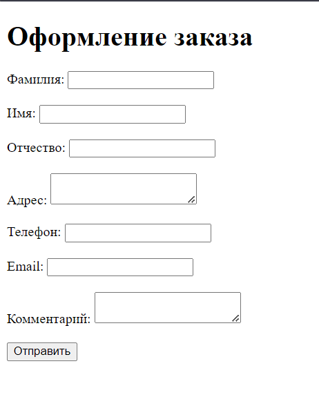
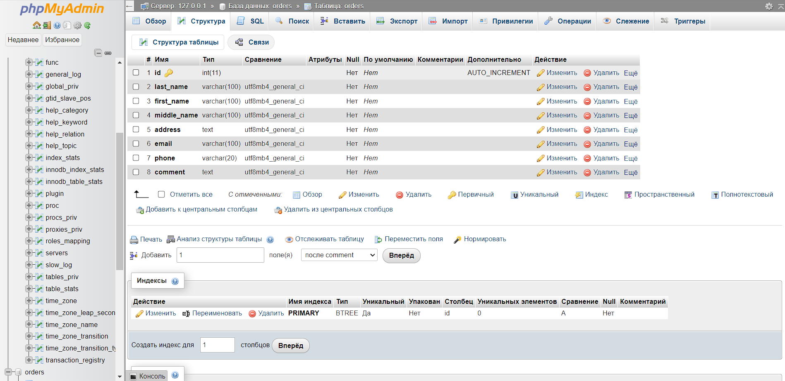
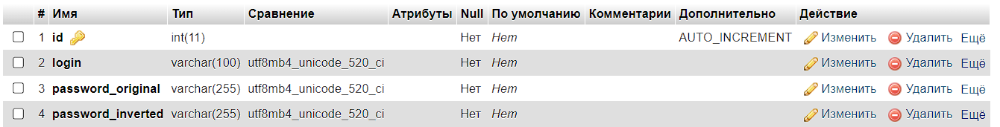
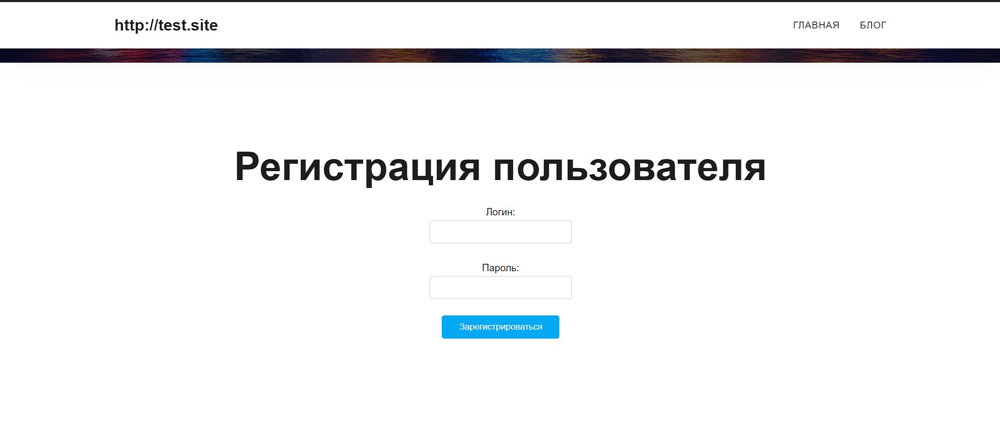
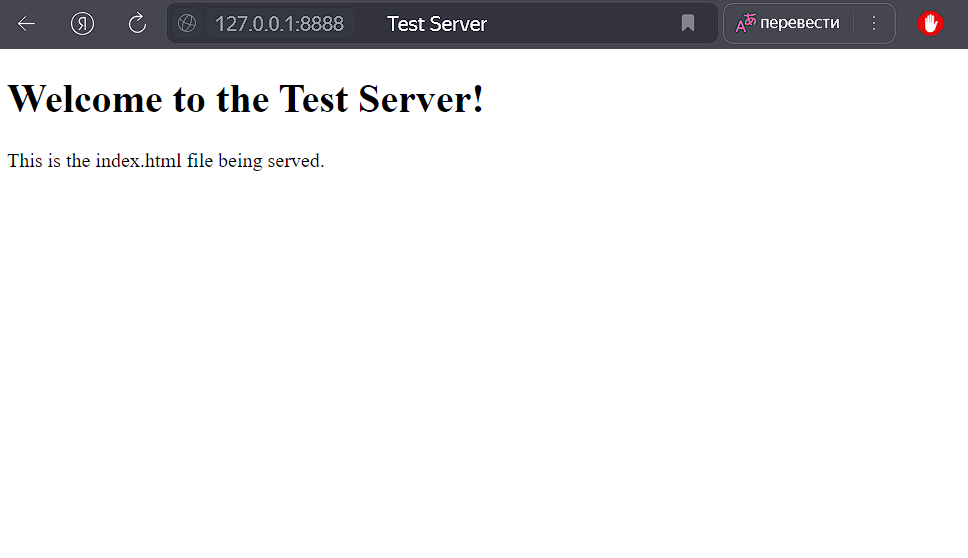
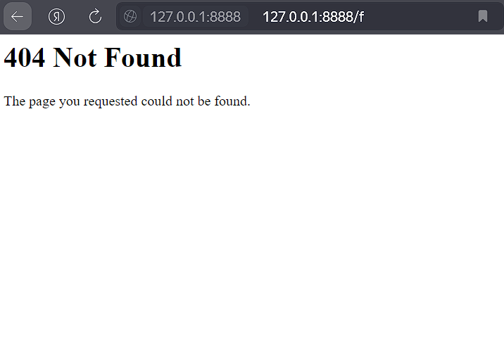

# Отчет по выполнению лабораторной раюоты №4

## Задание 1: Разработка веб-страницы с формой для ввода данных

### Описание задания
Была разработана веб-страница с формой, на которой пользователь может ввести свои данные:
- Фамилия
- Имя
- Отчество
- Адрес 
- Адрес электронной почты
- Телефон
- Комментарий к заказу

Данные из формы сохраняются в базе данных MySQL с помощью PHP-скрипта.

### Шаги выполнения

1. **Создание формы в HTML:**
   - Форма для ввода данных была создана в файле [order.html](order.html).
   

2. **Создание базы данных и таблицы:**
   - В MySQL была создана таблица для хранения данных формы с полями:
     - id (PK)
     - last_name, first_name, middle_name, address, email, phone, comment.
     

   

3. **PHP-скрипт для обработки данных:**
   - Написан скрипт для обработки POST-запроса и записи данных в таблицу базы данных.
   

---

## Задание 2: Модификация WordPress плагина

### Описание задания
Необходимо было модифицировать плагин для регистрации пользователей в WordPress, чтобы данные о логине и пароле записывались в базу данных. Также предусматривалась возможность инвертировать биты пароля.

### Шаги выполнения

1. **Создание плагина:**
   - Написан плагин для регистрации пользователей.
   
   - Реализована функция инвертирования битов пароля.

2. **Добавление записи данных в базу:**
   - Добавлены два столбца в таблицу для хранения оригинального пароля и инвертированного пароля.
   

3. **Добавление шорткода для формы регистрации:**
   - Форма была доступна через шорткод на страницах WordPress.
   

### Скриншоты
(Вставьте сюда скриншоты плагина, формы регистрации и базы данных)

---

## Задание 3: Создание веб-сервера на Python

### Описание задания
Создан веб-сервер на языке Python с использованием библиотеки Flask. Сервер возвращает содержимое файла `index.html`, расположенного в том же каталоге, где находится исполняемый файл.

### Шаги выполнения

1. **Настройка Flask:**
   - Установлена библиотека Flask для работы с веб-сервером.
   - Написан сервер с возможностью указания порта через аргументы командной строки.

2. **Обслуживание файла `index.html`:**
   - Сервер настроен для возврата содержимого файла [index.html](web_server/index.html) по запросу.
   

3. **Добавление обработки ошибок:**
   - Сервер теперь обрабатывает ошибку 404 и логирует все запросы.

---

## Заключение

В процессе выполнения заданий был создан полный функционал:
- Веб-форма для ввода данных и их записи в MySQL.
- Плагин для регистрации пользователей в WordPress с инвертированием пароля.
- Веб-сервер на Python с обработкой ошибок и логированием запросов.

Все задания были выполнены успешно, и функционал был проверен на каждом этапе.

---

