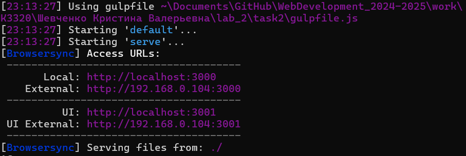
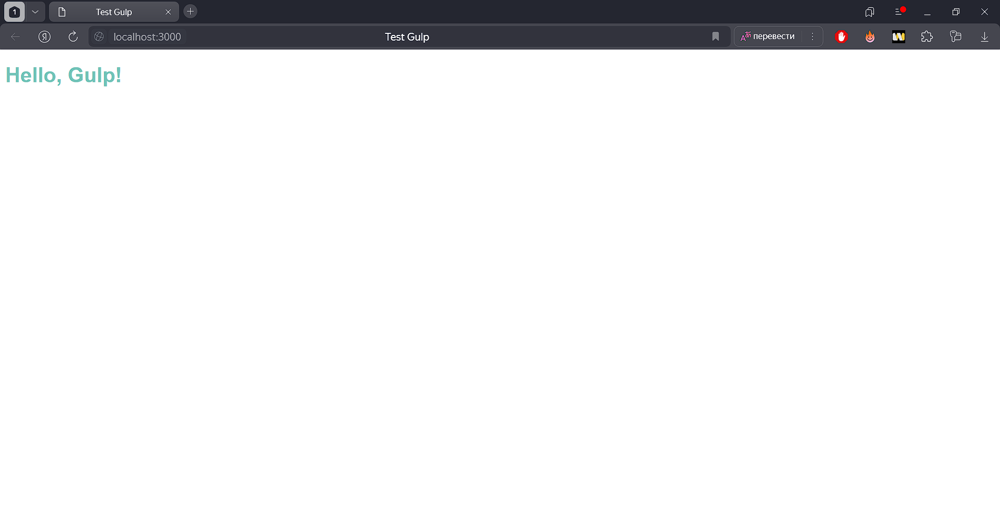
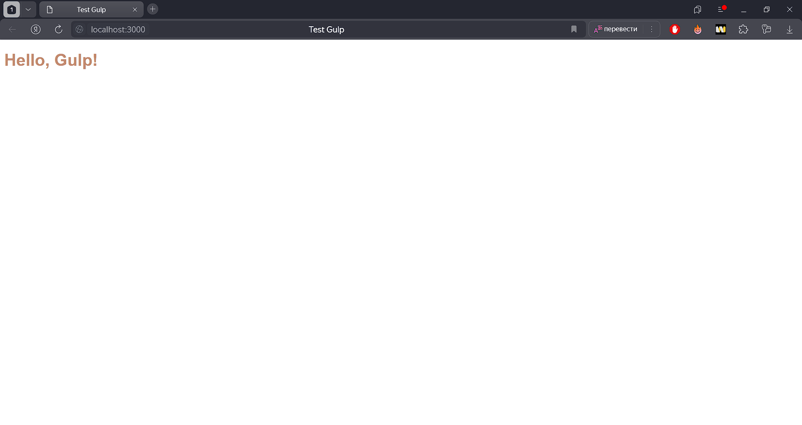
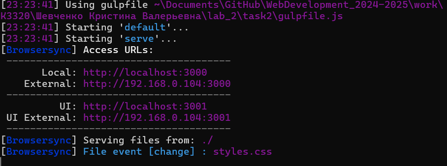

# Отчёт по выполнению лабораторной работы №2 Задание 2

## Тема: Установка Gulp и настройка задачи

### Выполнила:
Шевченко Кристина Валерьевна, группа K3320

---

## **Задание**

### 1. Установить Gulp

- Установить Node.js и npm. Проверить корректность установки командами:
  ```bash
  node -v
  npm -v
  ```

- Инициализировать проект в локальном репозитории:
  ```bash
  npm init -y
  ```

- Установить Gulp как dev-зависимость:
  ```bash
  npm install gulp --save-dev
  ```

- Проверить успешность установки Gulp:
  ```bash
  gulp -v
  ```

### 2. Настроить Gulp-задачу

- В корне проекта создан файл `gulpfile.js`.
- Установлен дополнительный пакет BrowserSync:
  ```bash
  npm install browser-sync --save-dev
  ```
- Написан следующий код для задачи `serve`:
  ```javascript
  const gulp = require('gulp');
  const browserSync = require('browser-sync').create();

  gulp.task('serve', function () {
      browserSync.init({
          server: {
              baseDir: './',
          },
      });

      gulp.watch('./*.html').on('change', browserSync.reload);
      gulp.watch('./*.css').on('change', browserSync.reload);
  });

  gulp.task('default', gulp.series('serve'));
  ```

### 3. Проверка работы Gulp

- Созданы тестовые файлы:
  - **`index.html`**
    ```html
    <!DOCTYPE html>
    <html lang="en">
    <head>
        <meta charset="UTF-8">
        <meta name="viewport" content="width=device-width, initial-scale=1.0">
        <title>Test Gulp</title>
        <link rel="stylesheet" href="styles.css">
    </head>
    <body>
        <h1>Hello, Gulp!</h1>
    </body>
    </html>
    ```

  - **`styles.css`**
    ```css
    body {
        font-family: Arial, sans-serif;
        color: rgb(78, 138, 160);
    }
    h1 {
        color: blue;
    }
    ```

- Запуск задачи выполнен командой:
  ```bash
  gulp
  ```

- Проверка работы:
  - Локальный сервер запустился: http://localhost:3000.
  - При изменении файлов HTML и CSS происходит автоматическая перезагрузка страницы в браузере.

---

## **Результаты**

### Успешно выполнены задачи:
1. Установлен Gulp и настроен проект.
2. Создана Gulp-задача для запуска локального сервера и слежения за изменениями в файлах.
3. Проверена автоматическая перезагрузка страницы при изменении файлов HTML и CSS

---

## **Скриншоты**

### Скриншот 1: Терминал с результатами установки Gulp и запуска задачи


### Скриншот 2: Браузер с локальным сервером


### Скриншот 3 и 4: Автоматическая перезагрузка страницы



---

## **Ссылка на проект**
[Ссылка на GitHub](https://github.com/krishevv/WebDevelopment_2024-2025/blob/lab_2/task2) 

