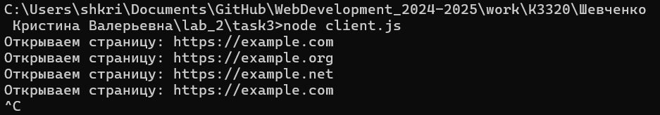
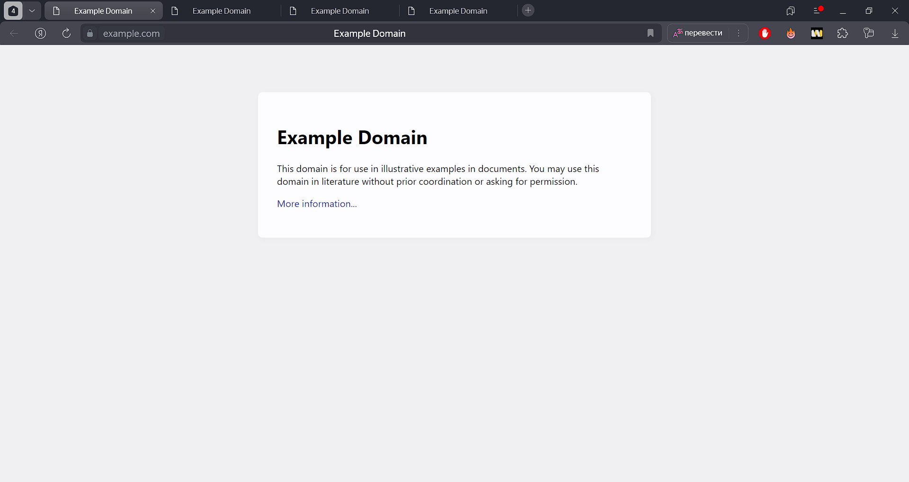
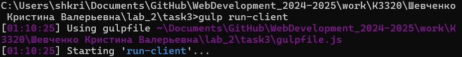

# Отчёт по выполнению лабораторной работы №2 Задание 3

## Тема:  Программа клиент для показа web-страниц.

### Выполнила:
Шевченко Кристина Валерьевна, группа K3320

---

## **Задание**

Рассмотреть программу клиент для показа web-страниц. Написать программу клиент, которая показывает web-страницы одна за другой из списка (в программе можно задавать адреса страниц и интервал показа).


### Требования

- Программа должна открывать веб-страницы в браузере через определённый интервал времени.

- В ходе работы оформить небольшой отчет:

    - Задание;

    - Скриншоты работы программы;

    - Ссылка на проект в репозитории Git;

    - Архив с проектом.


### Этап 1: Установка инструментов
1. Инициализирован проект Node.js с помощью команды `npm init -y`.
2. Установлены необходимые зависимости:
   - Gulp (для автоматизации задач);
   - BrowserSync (для работы с веб-сервером);
   - open (для открытия страниц в браузере).
3. Создан файл `gulpfile.js` для описания задач Gulp.

---

### Этап 2: Написание программы-клиента
В файле `client.js` (или `client.mjs`) реализована программа для открытия списка страниц через интервал времени. Использованы следующие технологии:
- Модуль `setInterval` для циклического переключения страниц.
- Пакет `open` для автоматического открытия страниц в браузере.

**Программа поддерживает:**
- Настраиваемый список URL-адресов.
- Настраиваемый интервал показа страниц.

**Код программы:**
```javascript
import open from 'open';

const pages = [
  'https://example.com',
  'https://example.org',
  'https://example.net',
];

let currentIndex = 0;
const interval = 5000; // Интервал в миллисекундах

function showPage() {
  const url = pages[currentIndex];
  console.log(`Открываем страницу: ${url}`);
  open(url);
  currentIndex = (currentIndex + 1) % pages.length;
}

setInterval(showPage, interval);
```


### Этап 3: Интеграция программы с Gulp
В gulpfile.js добавлена задача для запуска программы через Gulp:

```javascript
Копировать код
const gulp = require('gulp');
const { exec } = require('child_process');

gulp.task('run-client', (cb) => {
  exec('node client.js', (err, stdout, stderr) => {
    if (err) console.error(`Ошибка: ${err.message}`);
    if (stderr) console.error(`Предупреждение: ${stderr}`);
    console.log(stdout);
    cb();
  });
});

gulp.task('default', gulp.series('run-client'));
```
Теперь программа запускается командой:

```bash

gulp run-client
```


---


### Результаты работы


## **Скриншоты**

### Скриншот 1: Запуск программы через Node.js (команда node client.js).


### Скриншот 2 и 3: Открытие страниц в браузере (одна за другой)




---

## **Ссылка на проект**
[Ссылка на GitHub](https://github.com/krishevv/WebDevelopment_2024-2025/blob/lab_2/task3) 


### Вывод
#### В ходе выполнения работы:

- Реализована программа для показа веб-страниц из списка с заданным интервалом.
- Настроена интеграция программы с Gulp для автоматизированного запуска.
- Подготовлен отчет с описанием процесса и результатами выполнения задания.