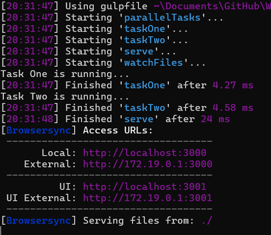
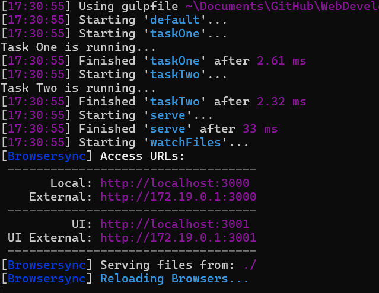
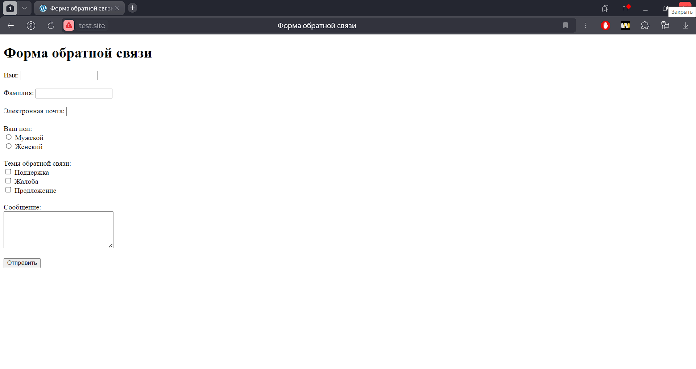
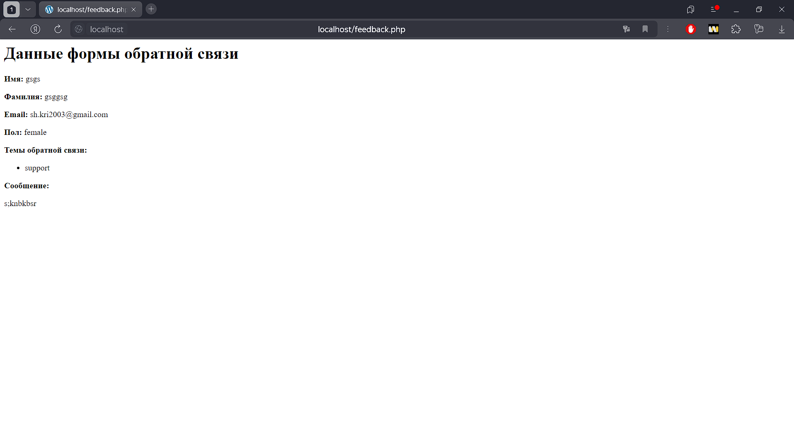
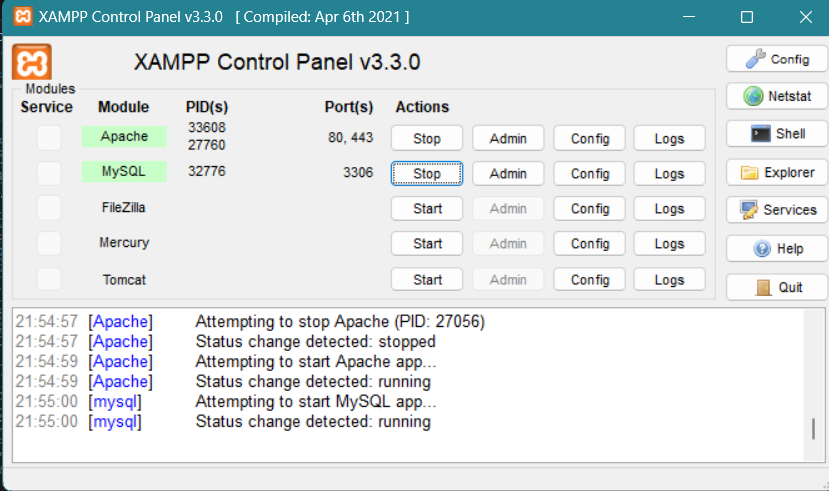
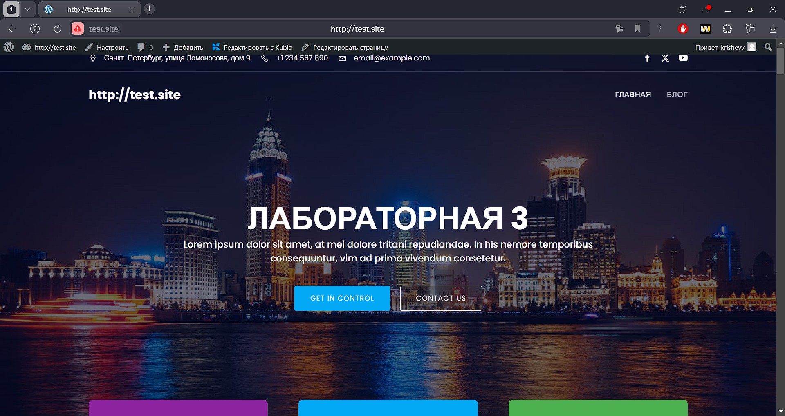

# Отчёт по выполнению лабораторной работы №3 

## Тема: Разработка веб-сайта с использованием Gulp, формы обратной связи и настройки локального сервера

### Выполнила:
Шевченко Кристина Валерьевна, группа K3320

---

## Задание
### Задание 1: Настройка Gulp
#### 1.1. Создание двух тасков для последовательного и параллельного выполнения
Для настройки Gulp был использован следующий код в файле gulpfile.js:

``` javascript
const { series, parallel, watch } = require('gulp');
const browserSync = require('browser-sync').create();

// Пример тасков
function taskOne(cb) {
    console.log('Task One is running...');
    cb();
}

function taskTwo(cb) {
    console.log('Task Two is running...');
    cb();
}

// Настройка Browsersync
function serve(cb) {
    browserSync.init({
        server: {
            baseDir: "./" // Базовая директория для запуска проекта
        }
    });
    cb();
}

// Таск для наблюдения за изменениями файлов
function watchFiles() {
    watch("*.html").on('change', browserSync.reload);
    watch("css/*.css").on('change', browserSync.reload);
    watch("js/*.js").on('change', browserSync.reload);
}

// Экспорт тасков
exports.default = series(taskOne, taskTwo, serve, watchFiles); // Последовательное выполнение с запуском сервера
exports.parallelTasks = parallel(taskOne, taskTwo, serve, watchFiles); // Параллельное выполнение с запуском сервера

```


#### 1.2. Настройка отображения файлов проекта в браузере и автоматической перезагрузки

Была использована библиотека browser-sync для автоматической перезарузки страницы при изменении файлов. Сервер был настроен с помощью команды ``gulp serve``, которая запускает локальный сервер и отслеживает изменения в папках scss, js, и HTML-файлах.



---

### Задание 2: Создание формы для отправки информации
#### 2.1. HTML форма
Форма была разработана для сбора информации от пользователя. Вот пример HTML-кода формы:

``` html
<body>
    <h1>Форма обратной связи</h1>
    <form action="feedback.php" method="post">
        <label for="name">Имя:</label>
        <input type="text" id="name" name="name" required><br><br>
        
        <label for="surname">Фамилия:</label>
        <input type="text" id="surname" name="surname" required><br><br>
        
        <label for="email">Электронная почта:</label>
        <input type="email" id="email" name="email" required><br><br>
        
        <label>Ваш пол:</label><br>
        <input type="radio" id="male" name="gender" value="male">
        <label for="male">Мужской</label><br>
        <input type="radio" id="female" name="gender" value="female">
        <label for="female">Женский</label><br><br>
        
        <label>Темы обратной связи:</label><br>
        <input type="checkbox" id="support" name="topics[]" value="support">
        <label for="support">Поддержка</label><br>
        <input type="checkbox" id="complaint" name="topics[]" value="complaint">
        <label for="complaint">Жалоба</label><br>
        <input type="checkbox" id="suggestion" name="topics[]" value="suggestion">
        <label for="suggestion">Предложение</label><br><br>
        
        <label for="message">Сообщение:</label><br>
        <textarea id="message" name="message" rows="5" cols="30" required></textarea><br><br>
        
        <button type="submit">Отправить</button>
    </form>
```
---

#### 2.2. PHP обработчик
Для обработки данных с формы был написан PHP-скрипт:

```php


<?php
// Проверяем, что данные отправлены методом POST
if ($_SERVER["REQUEST_METHOD"] === "POST") {
    // Получаем данные из формы
    $name = htmlspecialchars($_POST['name']);
    $surname = htmlspecialchars($_POST['surname']);
    $email = htmlspecialchars($_POST['email']);
    $gender = isset($_POST['gender']) ? htmlspecialchars($_POST['gender']) : 'Не указано';
    $topics = isset($_POST['topics']) ? $_POST['topics'] : [];
    $message = htmlspecialchars($_POST['message']);

    // Вывод данных на экран (эмуляция обработки)
    echo "<h1>Данные формы обратной связи</h1>";
    echo "<p><strong>Имя:</strong> $name</p>";
    echo "<p><strong>Фамилия:</strong> $surname</p>";
    echo "<p><strong>Email:</strong> $email</p>";
    echo "<p><strong>Пол:</strong> $gender</p>";

    echo "<p><strong>Темы обратной связи:</strong></p>";
    if (!empty($topics)) {
        echo "<ul>";
        foreach ($topics as $topic) {
            echo "<li>" . htmlspecialchars($topic) . "</li>";
        }
        echo "</ul>";
    } else {
        echo "<p>Темы не выбраны.</p>";
    }

    echo "<p><strong>Сообщение:</strong></p>";
    echo "<p>$message</p>";
} else {
    echo "<p>Данные формы не были отправлены.</p>";
}
?>
```

Форма отправляет данные с помощью метода POST, и PHP скрипт их обрабатывает.


---






### Задание 3: Установка инструментария для отладки
#### 3.1. Установка локального сервера
Для локальной разработки был установлен XAMPP:

- Скачан и установлен XAMPP.
- Запущены Apache и MySQL через панель управления XAMPP.

#### 3.2. Установка и настройка WordPress
- Скачан и установлен WordPress.
- В папке htdocs создана папка для сайта test.site.
- На локальном сервере была настроена база данных с помощью phpMyAdmin.
- После установки WordPress сайт был доступен по адресу: http://test.site.

#### 3.3. Работа с базой данных
Настройки сайта были проверены и изменены вручную через phpMyAdmin для корректной работы адресов сайта:

``` sql
UPDATE wp_options SET option_value = 'http://test.site' WHERE option_name = 'siteurl';
UPDATE wp_options SET option_value = 'http://test.site' WHERE option_name = 'home';
```

#### 3.4. Настройка темы
Для сайта была выбрана стандартная тема WordPress и активирована через админ-панель. После активации темы был настроен внешний вид сайта.

---
###  **Ссылка на проект**
[Ссылка на GitHub](https://github.com/krishevv/WebDevelopment_2024-2025/K3320/Шевченко_Кристина_Валерьевна/lab_3) 

## Заключение
Все задания были успешно выполнены. Были настроены Gulp для автоматизации задач, создана форма обратной связи с использованием HTML и PHP, а также установлен и настроен локальный сервер для разработки с использованием XAMPP и WordPress.

